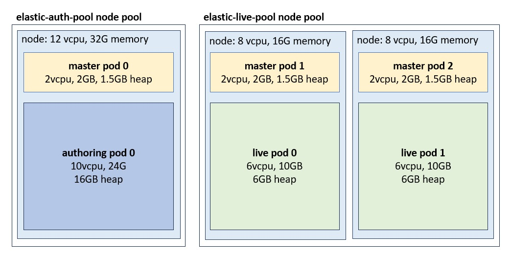

# ElasticSearch with dedicated Auth and Live nodes

> These steps apply to HCL Commerce 9.1.15+

For production environments, ElasticSearch is recommended in a clustered configuration for high availability and scalability considerations.

With the default clustered deployment, ElasticSearch automatically distributes the primary and replica shards to the available nodes (pods).
In an HCL Commerce deployment, with authoring and live configurations, ingest operations could create periods of heavy activity on ElasticSearch, that stress resources such as memory and CPU. If an ElasticSearch node hosts both authoring and live indices, ingest operations could impact query performance and affect the availability of the live storefront.

This documentation describes a sample configuration that defines dedicated ElasticSearch node groups for authoring and live. By separating authoring and live indices into two different node groups, we can prevent reindexing from impacting the live site.

## ElasticSearch installation

To setup ElasticSearch with dedicated node groups, each group is installed as a separate Helm release. This enables the use of different configurations for each group.
When each node group is started, they join a single ElasticSearch cluster.

The configuration presented here is a sample. You will need to adjust the node configurations such as memory and CPU, and the number of nodes to meet your requirements. Depending on your load requirements, you might need additional live nodes. You can also change the pod configurations to better match your available
infrastructure. 



The values files for each release are available here:
- [master.yaml](master.yaml)
- [auth.yaml](auth.yaml)
- [live.yaml](live.yaml)

The installation is done using Helm:

```
helm repo add elastic https://helm.elastic.co
kubectl create ns elastic
helm install es-master elastic/elasticsearch -f master.yaml -n elastic
helm install es-auth elastic/elasticsearch -f auth.yaml -n elastic
helm install es-live elastic/elasticsearch -f live.yaml -n elastic
```

### Elastic pods

In ElasticSearch terminology, an ElasticSearch node refers to an instance of ElasticSearch. In Kubernetes, ElasticSearch nodes are deployed as statefulsets and run as pods. The sample deploys pods with the following configurations and limits:

| group  |  pods | vcpu  |  memory  | heap  |
|---|---|---|---|---|
| *master*  | 3 | 2  | 2G  | 1.5G  |
| *auth*  | 1 | 10  | 24G  | 16G  |
| *live*  | 2 | 6  | 10G  | 6G  |

### Kubernetes node groups

The ElasticSearch node groups, that are installed as separate Helm releases, can be configured with different node affinity rules. For example, ElasticSearch live nodes (pods) can be deployed within a particular Kubernetes node pool.

This sample from Google Cloud, defines affinity rules so the pods are only deployed within nodes that belong to the elastic-live-pool node pool:

```
nodeAffinity:
  requiredDuringSchedulingIgnoredDuringExecution:
    nodeSelectorTerms:
      - matchExpressions:
        - key: cloud.google.com/gke-nodepool
          operator: In
          values:
            - elastic-live-pool
```

While it is possible to deploy auth and live to the same node pool, using separate node pools has the avantage that each pool can be configured with different
Kubernetes node characteristics. For example, the authoring node pool can be configured with a machine with more memory than the live pool.

The sample is deployed in Google Cloud (GKE) using the following node configurations:

| pools  |  nodes  | vcpu  |  memory  |
|---|------|---|---|
| *elastic-auth-pool*  | 1 | 12  | 32G  |
| *elastic-live-pool*  | 2 | 8  | 16G  |

If your cluster is not currently configured with multiple node pools, all other deployments must have affinity rules added, as otherwise they could deploy to any pool including the ElasticSearch ones. If a non-Elastic pod (e.g. Redis, Vault, etc) deploys to the Elastic node pools, the node might not be left with enough resources to start the ElasticSearch pods.

### Master node groups

Besides the node groups for authoring and live, the sample configuration defines a group of [dedicated master nodes](https://www.elastic.co/guide/en/elasticsearch/reference/current/modules-node.html#dedicated-master-node). These nodes do not handle traffic or maintain indices. Instead, their only responsability is to manage the cluster state. In production environments, it is recommended to have dedicated master nodes, as data nodes might become overwhelmed and unresponsive, and this could lead to cluster state synchronization problems.

The dedicated master nodes typically require few resources. The sample configures the limits to 2 vcpu,  memory to 2G and Java Heap to 1.5G. Monitoring should be used
to confirm these resources are sufficient.

In our example, master nodes can run within either the elastic-auth-pool or the elastic-live-pool node pools:

``` 
nodeAffinity:
  requiredDuringSchedulingIgnoredDuringExecution:
    nodeSelectorTerms:
      - matchExpressions:
        - key: cloud.google.com/gke-nodepool
          operator: In
          values:
            - elastic-auth-pool
            - elastic-live-pool
```

### Index affinity rules

The charts use `lifecycle/postStart` to automate required routing and sharding configurations. `index.routing.allocation.require.env` must match the node attribute `node.attr.env` configured in the same chart. Authoring is configured with 1 shard and no replicas. Live is also configured with 1 shard, but the number of replicas is configured to the number of nodes minus one. This ensures all live nodes maintain copies of all indices. In the example configuration, with two live nodes, one live node runs the primary shard, while the other runs a replica shard. If your configuration runs with more live pods, `number_of_replicas` must be updated.

#### Authoring index configuration

Index pattern configuration for authoring indexes:

```
{
    "index_patterns": [".auth*", "auth*", "log", "nlp", "run","live*"],
    "settings": {
        "index.routing.allocation.require.env": "auth",
        "number_of_replicas": 0,
        "number_of_shards": 1
    }
}
```

The inclusion of the `live*` index pattern (as opposed to `.live*` which is used in the live group) is to include a set of indices that must be kept within the authoring group. 

The `live.master.*` indices are copies of the production ready data which are kept within the authoring group, and are copied into the `.live.*` indices during `push-to-live`. Price and inventory data for the live environment is ingested into the `live.price` and `live.inventory` indices. These indices are copied into master indices and then propagated into the live environment.

The `live.store` index is used during ingest while the `.live.store.yyyymmddHHmm` index is a copy kept within the live group. This allows ingest and live operations to remain available even if the other ElasticSearch node group is unreacheable.

#### Live index configuration

Index pattern configuration for live indexes:

```
{
    "index_patterns": [".live*"],
    "settings": {
        "index.routing.allocation.require.env": "live",
        "number_of_replicas": 1,
        "number_of_shards": 1
    }
}
```

## Configuring NiFi

Additional configurations are required for NiFi to support the dual node group setup. The following example uses curl to apply the configurations using the shard queryapp server:

```
curl -XPATCH -v -u spiuser:<password> 'localhost:30900/search/resources/api/v2/configuration?nodeName=ingest&envType=auth'  -H 'Content-Type: application/json' -H 'Accept: application/json' -d@split.json
```

split.json:
```
{
    "global": {
        "connector": [
            {
                "name": "attribute",
                "property": [
                    {
                        "name": "flow.inventory.copy",
                        "value": "auth,live"
                    },
                    {
                        "name": "flow.price.copy",
                        "value": "auth"
                    },
                    {
                        "name": "alias.keep.backup",
                        "value": "0"
                    },
                    {
                        "name": "cluster.index.nodegroup",
                        "value": "dual"
                    }
                ]
            }
        ]
    }
}
```

## Connecting to ElasticSearch 

Each ElasticSearch release generates its own set of services. While all the nodes can handle requests for any index, there is additional overhead if the node handling the request does not locally manage the index. 

```
kubectl get services -n elastic
elasticsearch-auth                             ClusterIP   10.244.8.225   <none>        9200/TCP,9300/TCP   109m
elasticsearch-auth-headless                    ClusterIP   None           <none>        9200/TCP,9300/TCP   109m
elasticsearch-live                             ClusterIP   10.244.7.235   <none>        9200/TCP,9300/TCP   109m
elasticsearch-live-headless                    ClusterIP   None           <none>        9200/TCP,9300/TCP   109m
elasticsearch-master                           ClusterIP   10.244.6.29    <none>        9200/TCP,9300/TCP   109m
elasticsearch-master-headless                  ClusterIP   None           <none>        9200/TCP,9300/TCP   109m
```

The recommended configuration is to have the live servers use the live service `elasticsearch-live.elastic.svc.cluster.local`, while the rest can connect 
directly to the authoring node via the authoring service (`elasticsearch-auth.elastic.svc.cluster.local`).  The master nodes do not own indices and should never be used to connect to the cluster.

To use this configuration in Vault, define the `elasticSearchHost`, `elasticSearchPort` and `elasticSearchScheme` keys under the "live" branch, referencing the live service.

```
svt/qa/live/elasticSearchHost   value="elasticsearch-live.elastic.svc.cluster.local"
svt/qa/live/elasticSearchPort   value="9200"
svt/qa/live/elasticSearchScheme value="http"
```

The authoring service is referenced under the environment level. It is used when not running in live:

```
svt/qa/elasticSearchHost   value="elasticsearch-auth.elastic.svc.cluster.local"
```

## Validating the Environment

Once the installation of all the helm releases is complete (es-master, es-auth and es-live) and the statefulsets are started, all pods should form a single ElasticSearch cluster. This can be validated by executing the `/_cat/nodes` API as follows:

```
curl "localhost:9200/_cat/nodes?v"
ip          heap.percent ram.percent cpu load_1m load_5m load_15m node.role master name
1.1.1.0               12          89   0    0.06    0.11     0.10 m         -      elasticsearch-master-0
1.1.1.1               37          89   0    0.02    0.11     0.17 m         -      elasticsearch-master-1
1.1.1.2               43          90   0    0.00    0.14     0.14 m         *      elasticsearch-master-2
1.1.2.0                7          73   0    0.00    0.14     0.14 cdfhirstw -      elasticsearch-auth-0
1.1.3.0               21          56   0    0.06    0.11     0.10 cdfhirstw -      elasticsearch-live-0
1.1.3.1               13          56   0    0.66    1.13     0.71 cdfhirstw -      elasticsearch-live-1
```

After reindexing is complete, use the `_cat/indices` API to verify the indices' health is green. If the primary shard cannot be allocated, the index health will be 'red'. If a replica shard is not allocated, the index health is 'yellow'. If there are indices that are not green, there could be a problem with the ElasticSearch or NiFi configurations. The ElasticSearch [Cluster allocation explain](https://www.elastic.co/guide/en/elasticsearch/reference/7.17/cluster-allocation-explain.html#cluster-allocation-explain) API can describe reasons why the cluster is unable to allocate a shard.

```
curl "localhost:9200/_cat/indices?v"
health status index                                uuid                   pri rep docs.count docs.deleted store.size pri.store.size
green  open   .auth.12001.attribute.202312012227   R-Te5iRhS1CFXY0OZv0wKg   1   0         43            0     44.1kb         44.1kb
green  open   .auth.12001.catalog.202312012227     MAkWPxKhSfyHuxyEqFkFRA   1   0          3            0     10.5kb         10.5kb
green  open   .auth.12001.category.202312012227    HOoMtbyVRt6Ow8FPPUco6Q   1   0         54            0     70.7kb         70.7kb
green  open   .auth.12001.description.202312012227 JWGHyUevTaK8vszHvBfVUg   1   0        327            0    106.9kb        106.9kb
green  open   .auth.12001.page.202312012227        EOZXi76ITeiQdC3iUFXmog   1   0         10            0     13.4kb         13.4kb
...
```

Similarly, the `/_cat/shards` API shows the nodes on which each index is allocated. This is used to verify that the affinity for auth and live indices is working correctly.

```
curl "localhost:9200/_cat/shards?v"
index                                shard prirep state     docs   store ip        node
.auth.12001.category.202312051630    0 p STARTED    928   1.3mb 1.1.1.1 elasticsearch-auth-0
.auth.12001.description.202312051630 0 p STARTED 697064 494.7mb 1.1.1.1 elasticsearch-auth-0
...
.live.12001.category.202312011848    0 r STARTED    928   1.3mb 1.1.2.0 elasticsearch-live-0
.live.12001.category.202312011848    0 p STARTED    928   1.3mb 1.1.2.1 elasticsearch-live-1
.live.12001.description.202312011848 0 r STARTED 697064   508mb 1.1.2.0 elasticsearch-live-0
.live.12001.description.202312011848 0 p STARTED 697064   508mb 1.1.2.1 elasticsearch-live-1
...
```

## Migrating to a dual node group configuration

Existing environments can be migrated to a split auth and live configuration. To minimize down time, a new ElasticSearch cluster can be installed on a separate namespace while the original installation remains active. Indices on the new environment can be created by first migrating the authoring environment to the new ElasticSearch cluster and reindexing, or by exporting and importing the indices on the new cluster using the snapshot feature. Once the new cluster is up and running with current indices, the live environment can be switched to the new cluster.

These steps must be practiced in a pre-production environment. The migration should be done at an off-peak time.

1. Complete a new ElasticSearch cluster installation with dedicated auth and live node groups
2. Update the ElasticSearch endpoint configuration in Vault. Configure live (svt/qa/live/elasticSearchHost) to the existing cluster, and
authoring (svt/qa/elasticSearchHost) to the new cluster. See [Connecting to ElasticSearch](#Connecting-to-ElasticSearch)
3. Configure NiFi to enable the dual node group configuration. See [Configuring NiFi](#Configuring-NiFi)
4. Restart all the authoring pods. At this point, live should continue running against the original ElasticSearch cluster, while authoring is connected to the new dual node config
5. Run auth.reindex to populate the indices, and then run push-to-live
6. Validate the environment to confirm the indices were created on the correct ElasticSearch nodes. See [Validating the environment](#validating-the-environment)
7. Configure live (svt/qa/live/elasticSearchHost) in Vault to the new ElasticSearch cluster
8. Restart the QueryApp servers, and use the cache manager application to clear all caches. The QueryApp servers should now be using the new dual node group configuration
9. The original ElasticSearch environment be can shutdown at this point

If there is a need to revert back to the original configuration, ensure the original environment is up and running, configure Vault to use it, and restart the live QueryApp servers.
