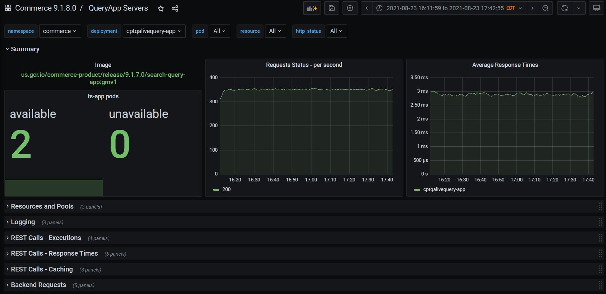
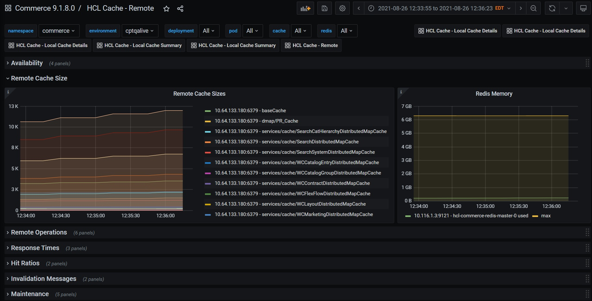

# HCL Commerce Monitoring - Prometheus and Grafana Integration

This document describes the HCL Commerce monitoring capabilities with Prometheus and Grafana, and how they provide real-time visibility into the health and performance of the application, to ensure SLAs are met and to aid with the troubleshooting and resolution of bottlenecks.

## HCL Commerce 9.1 Monitoring Architecture

HCL Commerce 9.1 introduced a monitoring framework based on Prometheus-style metrics. The HCL Commerce containers publish endpoints from which metrics can be read. This process is known as scraping. Prometheus discovers the pods to scrape by the use of annotations or ServiceMonitor definitions(CRD). The popularity of Prometheus and its metrics format has led to broad support, and today many 3rd-party monitoring tools can natively consume Prometheus-style metrics.

## Prometheus Install

A Prometheus-compatible monitoring system must be installed. If you are not consuming metrics with the Cloud's native monitoring framework or a 3rd-party system, you can install Prometheus Operator on the Kubernetes cluster. Grafana is also highly recommended to take advantage of the provided dashboards.

### Kube-prometheus-stack

Kube-prometheus-stack is the most popular and recommended option for installing Prometheus. It's an all-in-one install that includes Prometheus Operator (ServiceMonitor support), Grafana, and pre-configured instrumentations for Kubernetes monitoring.

https://github.com/prometheus-community/helm-charts/tree/main/charts/kube-prometheus-stack

```
helm repo add prometheus-community https://prometheus-community.github.io/helm-charts
helm repo update
helm install [RELEASE_NAME] prometheus-community/kube-prometheus-stack
````
### Prometheus

The following distribution installs Prometheus only. This option lacks ServiceMonitor CRD support. Grafana must be installed separately.

https://github.com/prometheus-community/helm-charts/tree/main/charts/prometheus

```
helm repo add prometheus-community https://prometheus-community.github.io/helm-charts
helm repo update
helm install [RELEASE_NAME] prometheus-community/prometheus
```

If ServiceMonitors are not defined, HCL Commerce must be installed with the _prometheusAnnotations_ option.

## HCL Commerce - Metrics Enablement

The HCL Commerce chart provides options for enabling integration with Prometheus. Although _metrics_ are enabled by default, the _serviceMonitor_ or  _prometheusAnnotations_ option must be enabled to match your Prometheus install. 

```
## Flag to enable metrics. Enabled by default
metrics:
  enabled: true
  ## Flag to add prometheus scraping annotations to pods. Disabled by default
  prometheusAnnotations:
    enabled: false
  ## Flag to enable service monitor. Disabled by default    
  serviceMonitor:
    enabled: false
    ## Specify a namespace in which to install the ServiceMonitor resource.
    ## Default to use the same release namespace where commerce is deployed to
    # namespace: monitoring
    # interval between service monitoring requests
    interval: 15s
    ## Defaults to what's used if you follow CoreOS [Prometheus Install Instructions](https://github.com/helm/charts/tree/master/stable/prometheus-operator#tldr)
    ## [Prometheus Selector Label](https://github.com/helm/charts/tree/master/stable/prometheus-operator#prometheus-operator-1)
    ## [Kube Prometheus Selector Label](https://github.com/helm/charts/tree/master/stable/prometheus-operator#exporters)
    selector:
      prometheus: kube-prometheus
```

If your Prometheus distribution supports ServiceMonitor CRDs, such as Kube-prometheus-stack, configure _metrics.serviceMonitor.enabled=true_. 

ServiceMonitors instruct Prometheus Operator what Commerce services to scrape, including details such as the path and the frequency. Prometheus Operator must be installed before using this option, as otherwise Kubernetes will not recognize the ServiceMonitor CRD and the Commerce installation will fail.

```
kubectl describe servicemonitor demoqaingest-app -n commerce
...
Spec:
  Endpoints:
    Interval:  15s
    Path:      /monitor/metrics
    Port:      metrics
  Namespace Selector:
    Match Names:
      commerce
  Selector:
    Match Labels:
      Component:  demoqaingest-app
```

The _prometheusAnnotations_ option is available since HCL Commerce 9.1.8. It is available when Prometheus Operator (and ServiceMonitors) are not used. When enabled, it adds
prometheus scrape annotations to the pods as follows:

```
  prometheus.io/scrape: "true"
  prometheus.io/path: /monitor/metrics
  prometheus.io/port: "8280"
```

Note: The NiFi pod exports two metrics endpoints. One with HCL Commerce metrics, such as for caching, and one native to NiFi (PrometheusReportingTask). When annotations are used, only the HCL Commerce metrics endpoint is exported.

# HCL Commerce - Grafana Dashboards

In this site you will find a set of Grafana Dashboards for HCL Commerce. These dashboards are designed to bring attention to critical metrics and highlight problems. They give insight into the overall performance, as well as internal components such as caching and backend services. The dashboards can be used in production, or to support the performance tuning process. They are the best way to learn and consume the metrics made available by Commerce. You can use them as-is, or customize to meet your needs. Following is a list of the dashboards currently provided:

### Compatibility:

The provided dashboards are tested with Grafana 7.5.5 and 8.1.4.


#### Transaction and QueryApp servers Dashboard

The _Transaction Servers_ and _QueryApp Servers_ dashboards include a comprehensive set of metrics that give you a detailed view into the performance and health of the servers.
The metrics displayed include:
- Summary: Container Image name; Number of pods (available and unavailable); Requests per second and average response times
- Resources and pools: JVM Heap; CPU Usage; WebContainer/Default Executor pool usage; Datasource usage (tsApp only)
- Logging: Total rate of logging ( messages per second by severity); Rate of warnings and errors, and rate of trace messages, by pod
- REST calls - executions: Total calls per second; Status (Http) per second; Total calls by resource per second, rate and increase
- REST calls - Response times: Average response times by resource; 95 and 99 percentile
- REST calls - Caching: Cache hits and misses per second; Cache hit ratios by resource
- Backend requests (QueryApp only): Active requests by service; Total calls per second per service Average response times, 95, and 99 percentiles




#### HCL Cache dashboards

There are currently three dashboards available for _HCL Cache: Remote Cache_, _Local Cache Details_ and _Local Cache Summary_.

*HCL Cache - Remote*:  
Performance statistics for the remote cache, including:
- Availability: Caches in outage mode (from circuit breakers)
- Remote Cache Sizes
- Remote Operations: get/clear/put/invalidate operations per second; error count
- Response Times: Averages; 95 and 99 percentiles
- Hit Ratios
- Invalidation Messages
- Maintenance



*Local Cache Summary*:
Single table per pod listing all caches and including sizes and footprint

*Local Cache Details*:
Detailed information for local caches including sizes in entries and footprint; hit ratios; operations and removals per second

## 3rd-party Grafana Dashboards

When using the Kube-prometheus-stack chart, Grafana is pre-configured with a number of dashboards for monitoring of Kubernetes, including nodes, pods and workloads. 
Besides installing the HCL Commerce dashboards, most of the stack used by Commerce makes their own dashboards available. The [Grafana](https://grafana.com/grafana/dashboards) website is a good source for finding additional dashboards.

Some of the 3rd-party dashboard you might want to configure include:
- [Nginx Ingress](https://github.com/kubernetes/ingress-nginx/tree/main/deploy/grafana/dashboards)
- [Redis](https://grafana.com/grafana/dashboards/11835)
- [NiFi](https://grafana.com/grafana/dashboards/12375) (Only with ServiceMonitors)
- [Zookeeper](https://grafana.com/grafana/dashboards/10465)

# Troubleshooting: Commerce Metrics Configuration Details

If you intend to integrate with a 3rd-party system, or for troubleshooting purposes, you might need additional details for the metrics configurations. The following sample commands will help you understand how your system is configured.

The _metrics_ port is defined within the service. For _demoqaauthts-app_, the metrics port maps to 5280.

```
kubectl describe service demoqaauthts-app
Name:                     demoqaauthts-app
Namespace:                commerce
...
Port:                     metrics  5280/TCP
TargetPort:               5280/TCP
NodePort:                 metrics  32313/TCP
Endpoints:                192.168.24.205:5280
```
You can verify the metrics generated by each Commerce container by querying the metrics port directly. The output will help you familiarize with the Prometheus
metrics format, and the metrics produced by each of the HCL Commerce pods.

```
kubectl exec -it demoqaauthts-app-56f94bb494-55qkm -- curl http://localhost:5280/monitor/metrics
# TYPE hclcache_cache_puts_total counter
hclcache_cache_puts_total{cachespace="demoqaauth",name="services/cache/WCCatalogEntryDistributedMapCache",scope="local",source="local",} 9.0
hclcache_cache_puts_total{cachespace="demoqaauth",name="services/cache/WCSystemDistributedMapCache",scope="local",source="miss",} 108.0
hclcache_cache_puts_total{cachespace="demoqaauth",name="services/cache/WCLayoutDistributedMapCache",scope="local",source="miss",} 1.0
hclcache_cache_puts_total{cachespace="demoqaauth",name="services/cache/WCCatalogEntryDistributedMapCache",scope="local",source="miss",} 28.0
```

If you are using Prometheus annotations, you can verify them with the _kubectl describe pod_ command:

```
  prometheus.io/scrape: "true"
  prometheus.io/path: /monitor/metrics
  prometheus.io/port: "8280"
```

When used with Prometheus Operator, HCL Commerce defines Service Monitors to instruct how often and from which services metrics can be scrapped. 

```
kubectl get servicemonitor -n commerce
```

If the output is empty, meaning the Service Monitors are not defined, ensure you have selected the option during Commerce install. The Service Monitors provide details into which Service is queried, the path and frequency. In other systems you might also see additional details such as authentications.

In this example, the _demoqaauthts-app_ service monitor utilizes the _demoqaauthts-app_ service, and executes the _/monitor/metrics/_ at a frequency of 15 seconds.

```
kubectl describe servicemonitor demoqaauthts-app -n commerce demoqaauthts-app
Spec:
  Endpoints:
    Interval:  15s
    Path:      /monitor/metrics
    Port:      metrics
  Namespace Selector:
    Match Names:
      commerce
  Selector:
    Match Labels:
      Component:  demoqaauthts-app
```

If they are consumed correctly, you should be able to query these metrics with Grafana or the Prometheus UI. If metrics are missing, ensure Prometheus is correctly scraping the Commerce pods. The Prometheus console provides details for the scraping process, and lists healthy and unhealthy endpoints. 
In the Prometheus console see the menu items: _Status > Targets_ and _Status > Service Discovery_ for ServiceMonitors.

