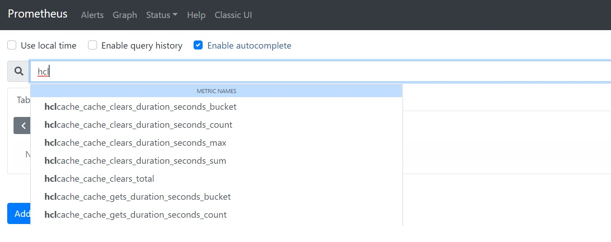
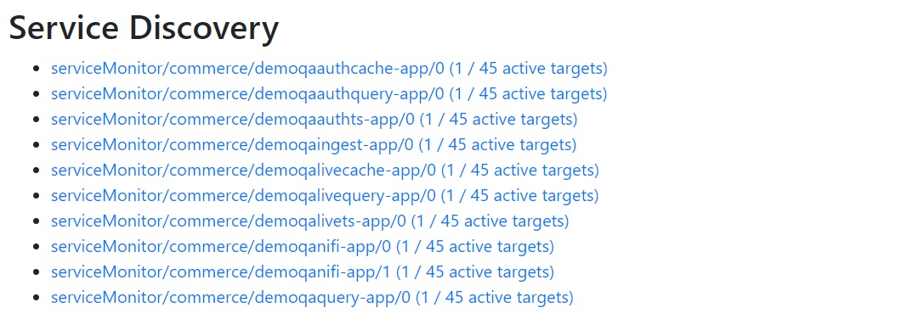
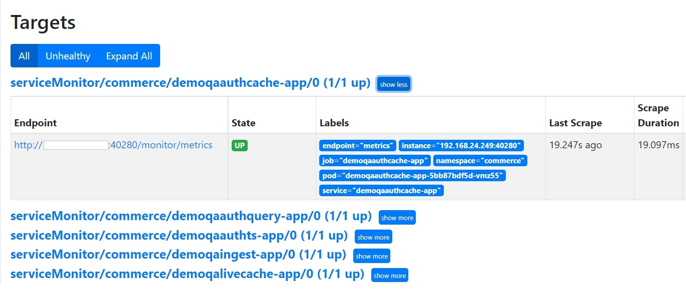

# Troubleshooting: Commerce Metrics Configuration Details

This document will help you troubleshoot installations where metrics are not displaying as expected, or if you plan to integrate HCL Commerce with a 3rd-party monitoring system.
It assumes you are using Prometheus Operator with ServiceMonitors. If you are using the standard Prometheus distribution, some sections will not apply.
Please review the [installation](PrometheusGrafanaInstall.md) document for details.

The high-level troubleshooting steps are as follows:
1. Use the *Grafana* dashboards to see if HCL Commerce data is not displayed. When Commerce data is not found, the variable selectors are empty (e.g. no option to select a namespace or deployment)
2. Use the *Prometheus* console to find if HCL Commerce metrics exist, for example, by typing _"hcl..."_

If the Prometheus console results data, the problem might be in the Grafana configuration or dashboard.
3. If the Prometheus search renders no results,  use the _Status > Targets_ and _Status > Service Discovery_ menu options to validate the HCL Commerce service monitors.
If the HCL Commerce service monitors are not listed, they are either not defined by HCL Commmerce or not consumed by Prometheus.


4. Run `kubectl get servicemonitor -n commerce` to validate that the service monitors are created. If the command returns no results, the _serviceMonitor_ option was not enabled during [installation](PrometheusGrafanaInstall.md).
5. If the service monitors are defined but not listed in the Prometheus console, the Prometheus configuration is preventing them from being used. Use the command to `kubectl edit prometheus -n monitoring` inspect the Prometheus resource and review the _serviceMonitorNamespaceSelector_ and _serviceMonitorSelector_ configurations. 
4. Finally, if the service monitors are defined and working, you should ensure that Commerce is returning metrics. See _Querying HCL Commerce Metrics Endpoints_ below.

### Querying HCL Commerce Metrics Endpoints

Use these steps to manually query the metrics endpoints for troubleshooting purposes. 

All the pods that make metrics available define a service named _metrics_ which is used by Prometheus. You can use the `kubectl describe` command to find the port number
used for metrics.

For example, for _demoqaauthts-app_, the metrics port maps to 5280:

```
kubectl describe service demoqaauthts-app
Name:                     demoqaauthts-app
Namespace:                commerce
...
Port:                     metrics  5280/TCP
TargetPort:               5280/TCP
NodePort:                 metrics  32313/TCP
Endpoints:                192.168.24.205:5280
```

The HCL Commerce containers expose metrics in http using the '/monitor/metrics' path. You can use curl to query the endpoint and verify the metrics that are returned:
The output will help you familiarize with the Prometheus metrics format, and the metrics produced by each of the HCL Commerce pods.

```
kubectl exec -it demoqaauthts-app-56f94bb494-55qkm -- curl http://localhost:5280/monitor/metrics
# TYPE hclcache_cache_puts_total counter
hclcache_cache_puts_total{cachespace="demoqaauth",name="services/cache/WCCatalogEntryDistributedMapCache",scope="local",source="local",} 9.0
hclcache_cache_puts_total{cachespace="demoqaauth",name="services/cache/WCSystemDistributedMapCache",scope="local",source="miss",} 108.0
hclcache_cache_puts_total{cachespace="demoqaauth",name="services/cache/WCLayoutDistributedMapCache",scope="local",source="miss",} 1.0
hclcache_cache_puts_total{cachespace="demoqaauth",name="services/cache/WCCatalogEntryDistributedMapCache",scope="local",source="miss",} 28.0
```

Inspecting the service monitors will confirm the port and path that is used to fetch metrics:

```
kubectl describe servicemonitor demoqaauthts-app -n commerce demoqaauthts-app
Spec:
  Endpoints:
    Interval:  15s
    Path:      /monitor/metrics
    Port:      metrics
  Namespace Selector:
    Match Names:
      commerce
  Selector:
    Match Labels:
      Component:  demoqaauthts-app
```

If your system uses Prometheus and not Prometheus Operator, then the scraping configuration is done thru labels on each pod as follows:

```
  prometheus.io/scrape: "true"
  prometheus.io/path: /monitor/metrics
  prometheus.io/port: "8280"
```


## Work-Arounds for Known Issues

### Unsupported Content Type

Since Helm Release 0.79.0 / 2024-12-13, Prometheus-operator includes Prometheus v3. Prometheus v3 is more strict concerning the Content-Type header received when scraping, and fails with the following errors if the Content-Type is unrecognized:

```
Error scraping target: received unsupported Content-Type and no fallback_scrape_protocol specified for target
Error scraping target: non-compliant scrape target sending blank Content-Type and no fallback_scrape_protocol specified for target
```

HCL Commerce versions 9.1.17.0 and prior do not correctly set the Content-Type response header on all containers. To avoid the error,
configure `scrapeFallbackProtocol` with value `PrometheusText0.0.4`.

```
prometheus:
  prometheusSpec:
    ...
    scrapeClasses:
    - default: true
      name: default
      fallbackScrapeProtocol: PrometheusText0.0.4
```

If you upgraded from a previous version running Prometheus v2, keep in mind that the `helm upgrade` operation does not update the CRD definitions by default, and the `fallbackScrapeProtocol` will not 
be available. Ensure the CRDs are up to date. See [Upgradind Chart](https://github.com/prometheus-community/helm-charts/tree/main/charts/kube-prometheus-stack#upgrading-chart)
and [Upgrade](https://github.com/prometheus-community/helm-charts/blob/main/charts/kube-prometheus-stack/UPGRADE.md)
for details.
