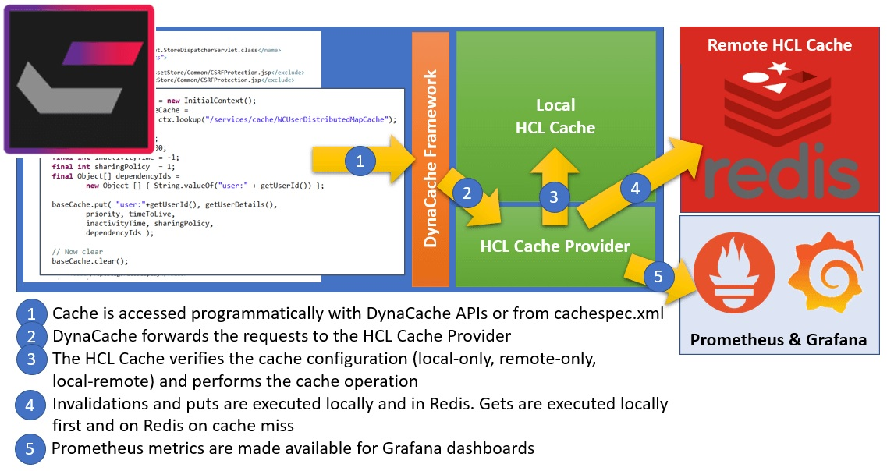

# HCL Cache Architecture

HCL Commerce has relied on the DynaCache in-memory caching service for several releases. DynaCache offers in-memory caching, disk off-loading, cache replication, and Servlet and JSP fragment caching. DynaCache also offers a pluggable architecture that enables the use of different cache providers (such as HCL Cache and IBM WebSphere eXtreme Scale) while maintaining access with a consistent set of interfaces such as [DistributedMap](https://www.ibm.com/docs/api/v1/content/SSEQTJ_9.0.5/com.ibm.websphere.javadoc.doc/web/apidocs/com/ibm/websphere/cache/DistributedMap.html) and [cachespec.xml](https://www.ibm.com/docs/en/was-nd/9.0.5?topic=caching-cachespecxml-file).

HCL Cache is installed as a DynaCache cache provider, which enables its use through DynaCache interfaces without code changes. HCL Cache extends the functionality of DynaCache and brings important improvements, including:
- Multi-tiered caching with [local and remote](LocalAndRemoteCaching.md) caching configurations
- Built-in support for replication of local cache [invalidations](Invalidations.md)
- Integration with [Prometheus and Grafana](Monitoring.md) for monitoring and alerting

When a cache (out-of-the-box or [custom](CustomCaching.md)) configured with the *HCL Cache* provider is accessed, DynaCache defers the processing to the custom provider. HCL Cache interacts with the local and remote caches, and replicates invalidations as required according to the [configuration](Configuration.md).

