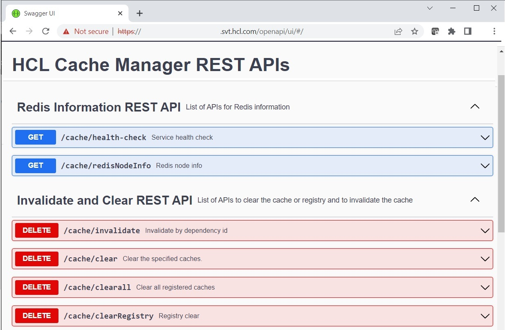
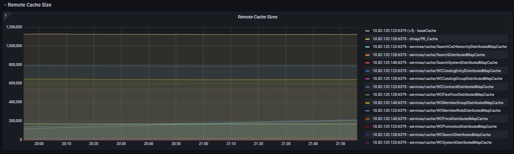

# HCL Cache Manager

The HCL Cache Manager provides a set of REST interfaces to interact with the cache, additional monitoring metrics, and a set of utilities 




## REST Interfaces

In addition to APIs to clear and invalidate cached data, the Cache Manager includes APIs that can be used to retrieve cache entry and dependency details for debugging information.

Issuing a cache clear on baseCache:
```
curl -X 'DELETE' 'https://cache.demoqalive.hcl.com/cm/cache/clear?cache=baseCache' 
```

**Redis Information REST API:**

| Method | Path | Description
|-- | -- | -- | 
| GET | /cache/health-check | Service health check | 
| GET | /cache/redisNodeInfo | Redis topology information | 

**Invalidate and Clear REST API:**

APIs to clear and invalidate caches:

| Method | Path | Description
|-- | -- | -- | 
| DELETE | /cache/invalidate | Invalidate by dependency id | 
| DELETE | /cache/clear | Clear the specified caches | 
| DELETE | /cache/clearall | Clear all registered caches | 
| DELETE | /cache/clearRegistry | Registry clear | 
| DELETE | /cache/publishInvalidation | Issues an invalidation id (PUBSUB) to local caches but doesn't clear the remote cache (for debugging purposes) | 

**Cache Information REST API:**

The following APIs are used for monitoring or debugging:

| Method | Path | Description
|-- | -- | -- | 
| GET | /cache | Returns a list of all the registered caches and current sizes | 
| GET | /cache/size | Remote size for cache | 
| GET | /cache/id/byDependency | Returns a list of cache ids associated to a dependency id (for debugging) | 
| GET | /cache/id/byIds | Returns cache entry details for the specified id (for debugging) | 

## Installing the Cache Manager

The Cache Manager pod must be enabled during installation in [values.yaml](https://github.com/HCL-TECH-SOFTWARE/hcl-commerce-helmchart/blob/87e05746dc4e5b412c663c858d180edcf2723e12/hcl-commerce-helmchart/stable/hcl-commerce/values.yaml#L1183) by configuring with `enabled: true`

```
cacheApp:
  name: cache-app
  enabled: true
```

For high availability, you might choose to run redundant Cache Manager pods.

## Accessing the Cache Manager

The Cache Manager can be accessed with `port-forwarding` or by enabling Ingress. The Swagger API is available under path `/openapi/ui/#/`

### Port forwarding

1- Start port forwarding to the Cache Manager service  
```
kubectl port-forward -n commerce service/demoqalivecache-app 40901:40901
```
2- Access the HCL Cache Manager Swagger/API using localhost and path `/openapi/ui/#/`
```
https://localhost:40901/openapi/ui/#/
```

### Ingress
Ingress access can optionally be enabled in 
[values.yaml](
https://github.com/HCL-TECH-SOFTWARE/hcl-commerce-helmchart/blob/87e05746dc4e5b412c663c858d180edcf2723e12/hcl-commerce-helmchart/stable/hcl-commerce/values.yaml#L596)
for both authoring and live. The Cache Manager endpoints do not implement authentication. Only enable access through ingress definitions that are internal and restricted.

```
  cache:
    auth:
      enabled: true
      domain: cache.{{ $.Values.common.tenant }}{{ $.Values.common.environmentName }}auth{{ $.Values.common.externalDomain }}
    live:
      enabled: true
      domain: cache.{{ $.Values.common.tenant }}{{ $.Values.common.environmentName }}live{{ $.Values.common.externalDomain }}
```

## Monitoring

The HCL Cache Manager makes available additional remote-only APIs, which are used from the *HCL Cache - Remote* dashboard:

| Metric | Use |
|-- | -- |
| hclcache_cache_size_current{ scope="remote" }| Size of remote cache in entries |
| hclcache_cache_size_maintenance| Number of expired keys pending maintenance |
| hclcache_cache_remote_node_mapping| Mapping between HCL Caches and Redis nodes |

See [Monitoring](Monitoring.md) for details.



## Utilities

The Cache Manager pod also makes available a number of cache utilities for benchmarking, debugging and configuration. They are available under the `/SETUP/hcl-cache/utilities`
directory. For more information see [Utilities.md](Utilities.md)


