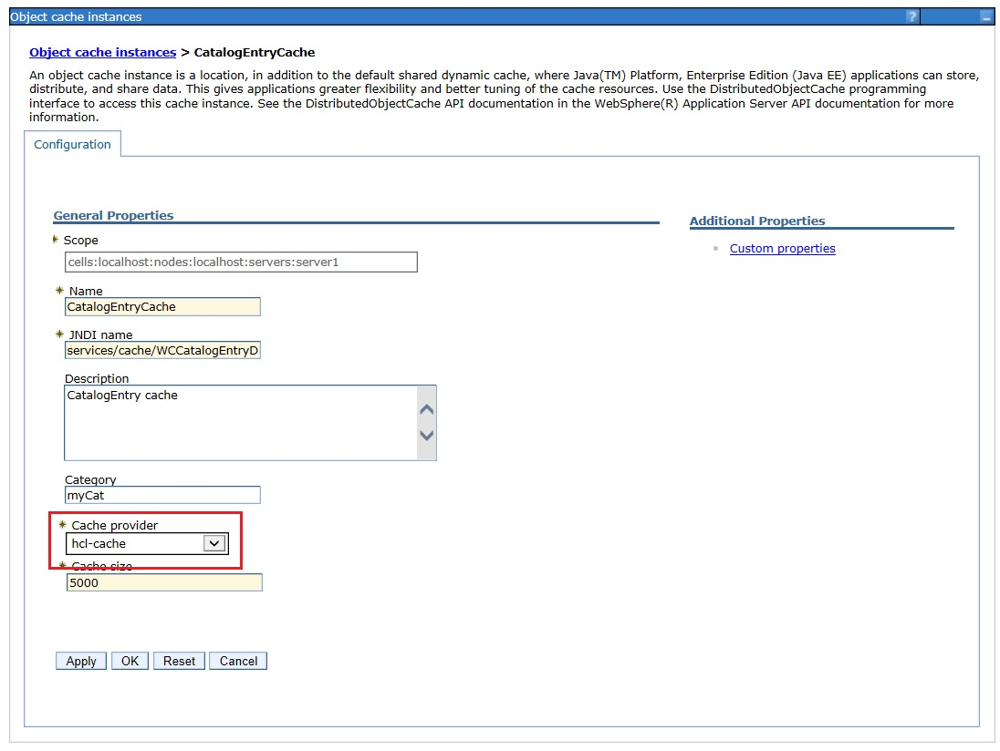
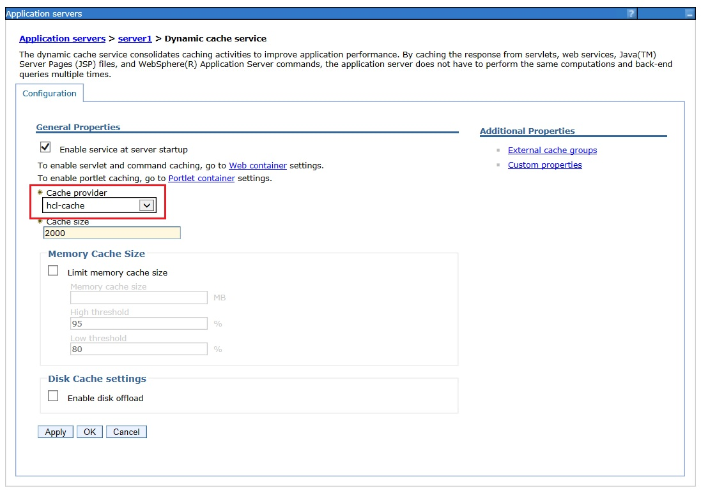

# HCL Cache in the Development Environment

Review the following configurations to use the HCL Cache in the Development Environment, or to implement custom caching.

## Redis in Docker

While the Development Environment can use a shared or remote Redis, the most common configuration is to run it locally with Docker.
The following sample command line can be used to start Docker with the latest image available:

```
docker run -it --name redis -d -e ALLOW_EMPTY_PASSWORD=yes -p 6379:6379 bitnami/redis:latest /run.sh --maxmemory 1000mb --maxmemory-policy volatile-lru --appendonly no --save ""
```

## HCL Cache configurations

The `CACHE_MANAGER_CONFIG` Java System Property configures the path to the cache configuration file to be used. It is set automatically
since 9.1.15.0. If your version doesn't define the System Property, it must be configured manually. In a WebSphere Liberty server, use the corresponding
jvm.options file. For the Transaction Server, use [Setting generic JVM arguments](https://www.ibm.com/support/pages/setting-generic-jvm-arguments-websphere-application-server) documentation. It's also recommended to enable the `expose_metrics` configuration, for the Cache Monitor to show cache statistics.

```
-DCACHE_MANAGER_CONFIG=${WCTOOLKIT_INSTALL}/setup/hcl-cache/cache_cfg.yaml 
-Dexpose_metrics=true
```

### HCL Cache Redis connection configuration

The path to the Redis client connection configuration file can be found under `WCDE_installdir\setup\hcl-cache\cache_cfg-ext.yaml` file. Ensure the path is correct and the contents point to the intended Redis instance.

```
redis:
  enabled: true
  yamlConfig: "C:/WCDE_V9/setup/hcl-cache/redis/singleserver/redis_cfg.yaml"
```

### Authoring and Live namespace configurations

The use of caching differs in authoring and live. In authoring mode, most caches are either disabled or use a shorter time-to-live (TTL). Configurations are also different. For example, the following `cache_cfg.yaml` snippet disables remote caching (Redis) when the namespace in use is 'auth':

```
  "[${TENANT:-}${ENVIRONMENT:-}auth]:defaultCacheConfig":
    remoteCache:
      enabled: false
  "[${TENANT:-}${ENVIRONMENT:-}live]:defaultCacheConfig":
    remoteCache:
      enabled: true
```

This cachespec.xml snippet from the Search QueryApp server only allows REST caching if the environment type is live:

```
  <component id="DC_Envtype" type="attribute" ignore-value="true">
    <required>true</required>
    <value>live</value>
  </component>
```

### Converting a Development Environment to Live

To test certain caches it might be desirable to reconfigure the Development Environment to use a live configuration.
This can be achieved in different ways.

To configure all servers as live, define the following Windows environment variables (under System Properties).
Servers must be restarted to use the new configuration.

- ENVTYPE: live
- CACHEENVTYPE: live

It is also possible to define these variables at the server level, using `server.env` for WebSphere Liberty based
servers, or for the Transaction Server, using the WebSphere Administrative Console: Process definition > Environment Entries.

## Custom Caching 

Custom caches must be registered to use the HCL Cache provider. While for runtime this is done using run-engine commands (see [Custom Caching](CustomCaching.md)),
in the Development it must be done manually.

### WebSphere Liberty-based servers

For Liberty-based servers, caches must be configured with HCL Cache under the dropins directory. See [Liberty containers](CustomCaching.md#liberty-containers) for details.

### Transaction Server

Custom caches registered in the Transaction Server must be configured to use the HCL Cache provider. 

Use this configuration in the WebSphere Administrative Console: Resources > Cache instances > Object cache instances



The baseCache is configured under: Servers > Server Types > WebSphere Application servers > server1 > Dynamic cache service



If a cache is configured with the HCL Cache provider, you should see a message similar to this in the logs:

```
DYNA1001I: WebSphere Dynamic Cache instance named services/cache/CustomCache initialized successfully.
DYNA1071I: The cache provider "com.hcl.commerce.cache.dynacache.HCLCacheProvider" is being used.
```

In order to use REST/Servlet caching in the Transaction Server, ensure the "Enable servlet and command caching" option is enabled 
under Servers > Server Types > WebSphere Application servers > server1 > Web Container Settings > Web container.


### HCL Cache Manager

The HCL Cache Manager server is available in the Development Environment as a Docker container.

The redis_cfg.yaml and cache_cfg-ext.yaml configuration files must be mounted from the Windows development environment to be available within the container:

```
docker run -d --name=cacheManager -e LICENSE=accept -p 40900-40901:40900-40901 -v WCDE_installdir/setup/hcl-cache/redis/singleserver/redis_cfg.yaml:/SETUP/hcl-cache/redis_cfg.yaml -v WCDE_installdir/setup/hcl-cache/cache-manager/cache_cfg-ext.yaml:/SETUP/hcl-cache/cache_cfg-ext.yaml cache-app:version
```

The redis_cfg.yaml file must not reference "localhost" as this represents a port within the container and not the host machine.
The host.docker.internal hostname can typically be used to reference a port in the host machine.

To use the Cache Manager with the Docker Compose deployment method (9.1.12+), update the env.sh configuration file with DEPLOYMENT_TYPE=toolkit set CACHE_ENABLED=true,and specify the CACHE_APP_IMAGE.


