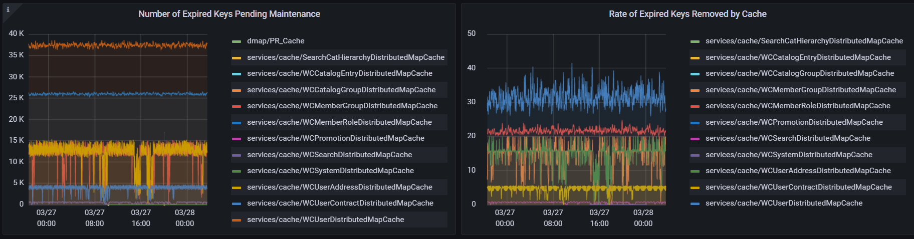

# HCL Cache Maintenance (9.1.9)

HCL Cache implements a number of required maintenance processes.

To support features such as invalidation by dependency id, the HCL Cache maintains metadata information for each cache entry. This metadata cannot be expired or evicted by Redis as this would lead to inconsistences such as missed invalidations.

HCL Cache implements a number of background processes to maintain the metadata information:
* Expired Maintenance: Removes metadata for objects that have expired 
* Low Memory Maintenance: Triggers when Redis memory is close to full and removes soonest to expire cache entries to free up memory

For more details, see [Memory Management in Redis](RedisMemoryManagement.md).

> The maintenance jobs can add overhead to the Redis servers. It is important that performance test environments accurately simulate production environments, exercising the maintenance processes in a similar manner. For example, if the production environment typically fills up the Redis memory, the performance environment should do the same. Short tests ( e.g. 1 hour) might not be long enough to simulate expired and inactivity maintenance processing conditions

See [HCL Cache Maintenance](HCLCacheMaintenance.md) for latest available configurations. Compared to the latest available, the key differences are as follows:
- In 9.1.9, Low Memory Maintenance uses the fastest available configuration (cleanupRate) for Expired Maintenance. In 9.1.10+ Low Memory Maintenance has its own configuration
- Inactivity Maintenance is not available in 9.1.9 

## Self-Adjusting Maintenance Processes

All maintenance processes implement a similar technique to self-adjust the speed of maintenance. Executing maintenance too quickly can impact performance, while if done too slowly, new data can be added at a rate that is faster than it is removed, leading to out of memory (OOM) situations.
For example, *Expired Maintenance* adjusts the speed of maintenance considering the time since expiry of the oldest expired cache entries. If the time since expiry increases, it means expired maintenance is not running at a fast enough rate, and the speed is increased.

The maintenance processes also have configurations to determine how many cache entries are removed at once. This is required because Redis is single-threaded, and a large maintenance operation can block Redis:

- numCacheIdPerLUACall: This is the maximum number of cache entries that will be inspected and processed by a LUA script. Increasing the number speeds up maintenance but can also block the Redis thread for a longer period.
- numLUACallsInPipeline: The number of LUA scripts that are sent together as a batch. The Redis thread is only locked during each individual script execution.

> LUA is a scripting language supported by Redis for server-side operations. LUA scripts are atomic and blocking

> Due to the self-adjusting nature of the maintenance processes, tuning should not typically be required, but performance testing is critical to confirm they run at optimal speeds.

## Expired Maintenance (onlineExpiredEntriesMaintenance)

While Redis automatically removes expired cached values from memory, the Expired Maintenance process is responsible for removing expired cache entries from the metadata
(dependency ids). This process runs from all the pods and the speed is determined by the age of the oldest expired entry pending maintenance.

#### Expired Maintenance cleanup rates

The speed of maintenance adjusts depending on the age of the oldest expired entry. For example, if the maintenance process finds cache entries that have been expired for 12 minutes, it will use the maintenance configuration for objects from 10-13 minutes, which cleans at a rate of 20/second.

```
newerThan:  300 secs (  5 mins) inLUA:  1 pipeline:  1 delayMs:  60000 -- speed:   0.02/sec,       1/min
newerThan:  600 secs ( 10 mins) inLUA:  2 pipeline:  5 delayMs:   1000 -- speed:     10/sec,     600/min
newerThan:  780 secs ( 13 mins) inLUA:  2 pipeline:  5  delayMs:   500 -- speed:     20/sec,   1,200/min
newerThan:  900 secs ( 15 mins) inLUA:  3 pipeline:  5 delayMs:    300 -- speed:     50/sec,   3,000/min
newerThan: 1200 secs ( 20 mins) inLUA:  3 pipeline: 10 delayMs:    250 -- speed:    120/sec,   7,200/min
newerThan: ~ ALL ~              inLUA:  5 pipeline: 10 delayMs:    200 -- speed:    250/sec,  15,000/min
```

For details on updating the configuration see [updating the default maintenance values](#updating-the-default-maintenance-values).

Expired maintenance details from the [HCL Cache - Remote](Monitoring.md) dashboard:


## Low Memory Maintenance (onlineInactiveEntriesMaintenance)

HCL Cache with Redis does not perform well when memory is full.  Processes, including maintenance processes, can fail with memory errors (*"command not allowed when used memory > 'maxmemory'"*). To prevent this situation, HCL Cache monitors the percentage of memory used and triggers Low-Memory maintenance processing to reduce the size of each cache. The processing removes both cached values and their associated cache entry metadata. The keys selected for removal are those sooner to expire.
The Low Memory Maintenance job is scheduled from all the pods, but it can only be active from a single container at any one time.

### Low Memory Maintenance in Redis Enterprise

Due to differences in architecture, Redis Enteprise does not make used memory statistics available to the application. But this is the trigger the Low Memory Maintenance process uses to determine when and how much maintenance is required. As a result, with Redis Enterprise, the `softMaxSize` configuration must be manually configured for each cache to define a maximum size in number of entries.

### Low Memory Maintenance default configurations

The default configurations are as follows. For details on updating the configuration see [Updating the default maintenance values](#Ipdating-the-default-maintenance-values).

Configuration | Default | Use
--- | --- | --- |
intervalSecs | 120 | Interval at which the Low-Memory maintenance job runs on each pod to check for memory conditions. |
maxMemoryPercentage | 93 | If the percentage of memory used is at or above this configuration, the maintenace process must execute.  | 
maintenancePercentageBuffer | 5 | The percentage of the cache that is removed. For example, if *maxMemoryPercentage* is 93% and *maintenancePercentageBuffer* is 5%, the target memory used after maintenance is 88%.
putOperationPausePercentage | 5 | This percentage is added to the maxMemoryPercentage. For example, if *maxMemoryPercentage* is 93% and *putOperationPausePercentage* is 5%, when used memory reaches 98%, caches stop inserting to the remote cache to allow maintenance to catch up.
softMaxSize | -1 | Used to set a maximum size in entries. It can be used in combination with *maxMemoryPercentage*.

#### Low Memory Maintenance cleanup rates

Low Memory Maintenance cleanup rates rely on the [Expired Maintenance](#Expired-Maintenance-Cleanup-Rates) configuration. Low Memory Maintenance uses the fastest configuration available for Expired Maintenance which is currently 250 keys/sec or 15,000 keys/min.

> The default configuration of 250 keys/second might not be fast enough for certain production environments and might need to be updated. See [Updating the Default Maintenance Values](#Updating-the-Default-Maintenance-Values) for details.

## Updating the Default Maintenance Values

Although due to the self-adjusting nature of the scripts, tuning may not be required, configurations can be changed by updating the  [Cache YAML configuration files](CacheConfiguration.md). Configurations can be changed at the cache level, or for all caches by using `defaultCacheConfig`:

```
cacheConfigs:
   defaultCacheConfig:
     remoteCache:
       onlineExpiredEntriesMaintenance:
         ...
       onlineLowMemoryMaintenance:
         ...
```

The following links include YAML snippets for the default (starting) configurations:
- [onlineExpiredEntriesMaintenance](samples/onlineExpiredEntriesMaintenance.919.yaml)

> For list configuration such as `cleanupRate`, customizations must re-define the whole list instead of individual elements

