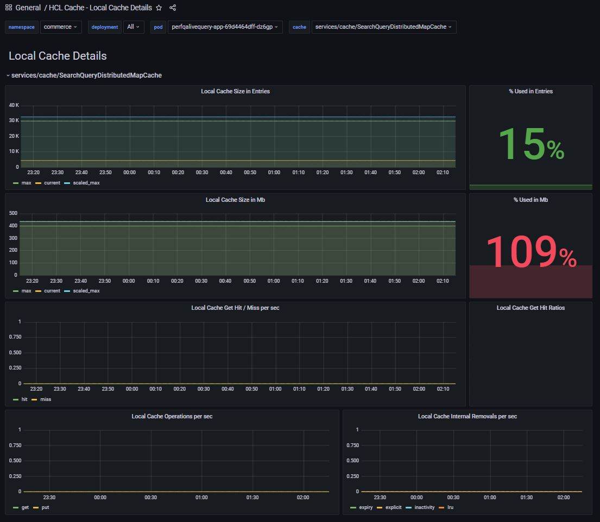

# HCL Cache - Local and Remote Caching
The HCL Cache extends the capabilities of DynaCache by enabling the use of remote caching supported by Redis.

## Local Caching
The behaviour of local caching is similar to that of the traditional DynaCache caches, with some important differences:

### Replication of invalidation messages
The use of local caching requires the replication of cache clear and invalidation messages to ensure stale or outdated content is removed from caches on other containers.
In Commerce V9.0 this was achieved with the use of Kafka. When HCL Cache is enabled with Redis, invalidations are handled automatically by the framework. See
[Invalidations](Invalidations.md) for details.

### Automatic memory footprint tuning
The HCL Cache framework simplifies the tuning of local cache sizes with [Automatic Memory Footprint Tuning](LocalCacheAutoTuning.md) which can automatically resize local caches according to the amount of free memory.

### Monitoring capabilities
HCL Cache implements a comprehensive set of metrics for local caches to support monitoring, debugging and tuning. The metrics enable tracking of cache sizes (by number of entries and memory footprint in MB), hit ratios, cache operations and internal removals per second (expiry, inactivity, explicit removal and LRU eviction).
Local cache metrics can be tracked with the *"HCL Cache - Local Cache Details"*, and *"HCL Cache - Local Cache Summary"* dashboards. See [Monitoring](Monitoring.md) for details.

*HCL Cache: Local Cache Details - dashboard:*

### Use of disk offload
HCL Cache caches do not support disk offload. Disk offload configurations in WebSphere DynaCache are ignored. To scale beyond the local JVM's memory limits, local caches are designed to be used in conjunction with remote Redis caches.

### WebSphere Extended Cache Monitor
See [WebSphere Cache Monitor](WebSphereCacheMonitor.md) for details.

## Remote Caching
Extending the caching framework with the use of a remote cache in Redis can improve performance and scability:
- Remote caches aren't bound by the local JVM limits: Remote caches can scale to hundreds of gigabytes. Large caches can render higher hit ratios, improving performance and reducing the need to regenerate content, thus reducing the overhead in other services and databases.
- Scalability is improved: With the use of local caches, each server must maintain its own cache. Cache entries might need to be generated once per pod. For example, each pod must generate and maintain its own copy of the home page. When only local caching is used, increasing the number of containers increases the overall number of cache misses, resulting in increased load on backend services, such as the primary database for HCL Commerce or the Search database (Solr or Elastic Search).
But when remote caching is used, each remote cache entry only needs to be created from backend services once. Servers using both local and remote caching (QueryApp, TsApp, Search) can be scaled up and consume existing cache from the remote cache instead of regenerating its own from backend services. Newly started containers have immediate access to the existing cache and the impact of the "warm up" period is greatly reduced. This advantage also applies to cache clear scenarios.

> In order to use remote caching, cache entries cache must be serializable. By default, remote caches that encounter serialization errors are disabled:
> *Remote Caching is disabled for this cache due to previous serialization errors. Ensure all cache entries are serializable. If entries cannot be made serializable, consider disabling remote caching for this cache. The stopRemoteCachingOnSerializationErrors configuration can be used to continue allowing remote caching after serialization errors*

## Choosing a Deployment Option

### Local and remote caching 
This is the default configuration. Local caches act as a near-cache for remote caches, keeping copies of the most recently accessed cache entries. These cache entries can be served directly from the local container, without making remote calls to the Redis servers, improving performance and reducing overhead on remote servers.

#### Local and remote caching flows:

When local and remote caches are used together, the caching flow is as follows:

Cache Miss | Existing in Local | Existing in Remote
--- | --- | --- |
1- Local miss  | 1- Local hit | 1- Local miss
2- Remote miss |  | 2- Remote hit
3- Local PUT |  | 3- Local PUT (internal)
4- Remote PUT |  | 

### Local only caching
The primary reason for disabling remote caching is if the objects stored in the cache are not serializable. If custom caches store objects that are not serializable, 
remote caching should be disabled for the cache in the configuration. See [Configuring HCL Cache options](CustomCaching.md#configuring-hcl-cache-options) for details.
Local only caches must still use Redis for replication of invalidations.

### Remote only caching
Remote only caching might be desirable for caches that store frequently updated objects, when changes must be immediately available to all containers. For example, changes to user session data must be immediately available to all containers. Disabling local caches eliminate the risk of reading stale data due to timing issues with invalidations. Examples of out of the box caches that are configured as *remote only* include caches for Precision Marketing and Punch-out integration.
