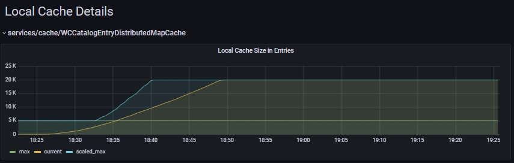

# Local Caching - Automatic Memory Footprint Tuning

Local caches reside in the local application server JVM.  Each local cache holds a number of cache entries, and each cache entry has a cache id, a cache value, and a list of dependency ids.  Controlling the memory footprint of local caches is important, since larger caches can improve performance, but a cache that is too large can lead to low or out of memory conditions.

Each local cache has a configured maximum number of cache entries it can hold (memorySizeInEntries) and an optional maximum memory footprint (memorySizeInMB).  For example, in a Liberty application server configuration server.xml file, the following line configures the memory footprint of the HCL local cache with JNDI name services/cache/SearchQueryDistributedMapCache:

```
<distributedMap id="services/cache/SearchQueryDistributedMapCache" cacheProviderName="hcl-cache" memorySizeInEntries="30012" memorySizeInMB="400" lowThreshold="95" highThreshold="98"/>
```

By default, HCL local caches automatically increase or decrease their memory footprint according to how much JVM heap is available.  When the JVM heap is less than 65% used, HCL local caches will increase their maximum sizes up to 400% of their configured sizes, and conversely when the JVM heap is more than 70% used, they will decrease their maximum sizes down to 10% of their configured sizes.  In this way, HCL local caches take advantage of available free memory, while helping to avoid low or out of memory conditions.

*Screen capture from the HCL Cache - Local Cache Details dashboard. For more details see [Monitoring](Monitoring.md).*



## Automatic Memory Footprint Tuning Configurations

The automatic memory footprint tuning feature provides configurations that can be used for advanced troubleshooting or tuning scenarios.
See [Cache Configuration](CacheConfiguration.md) for details of updating the HCL Cache configuration.

`globalLocalCache` is a top level element. 

- [Configuring used memory thresholds](#Configuring-used-memory-thresholds)
- [Configuring minimum and maximum scale factors](#Configuring-minimum-and-maximum-scale-factors)
- [Disabling automatic memory footprint tuning](#Disabling-automatic-memory-footprint-tuning)
- [Reporting unsizeable cache values](#Reporting-unsizeable-cache-values)

#### Configuring used memory thresholds

By default, caches can increase their maximum sizes when used JVM memory is less than 65% of the maximum heap size, and will decrease their maximum sizes when used JVM memory is more than 70% (prior to version 9.1.13 the default was 75%) of the maximum heap size.

```
globalLocalCache:
  localCacheTuning:
    tightMemoryPercentUsedThreshold: 70
    normalMemoryPercentUsedThreshold: 65
```

#### Configuring minimum and maximum scale factors

By default, caches will not increase their maximum sizes to more than 400% of their configured maximum sizes, and will not decrease their maximum sizes to less than 10% of their configured maximum sizes.

```
globalLocalCache:
  localCacheTuning:
    maxScaleFactor: 400
    minScaleFactor: 10
```

#### Disabling automatic memory footprint tuning

By default, automatic memory footprint tuning is enabled.  You can disable it by specifying `false`.

```
globalLocalCache:
  localCacheTuning:
    enabled: true
```

#### Reporting unsizeable cache values

HCL local cache can calculate the memory footprint of cache entries when they contain values composed of typical java objects.  When other objects are encountered, the calculated memory footprint may be inaccurate.  Specify `reportUnsizeable: true` to log an information message when HCL cache is unable to calculate an accurate object memory footprint.  The default value of this configuration setting is `false`.

```
globalLocalCache:
  reportUnsizeable: false
```

