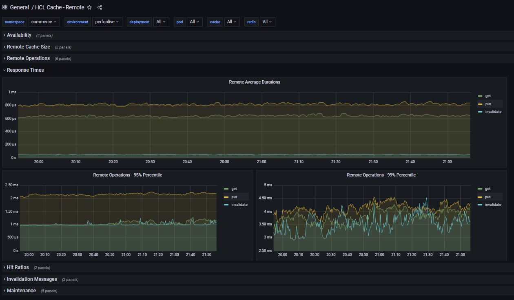

# HCL Cache - Monitoring

The HCL Cache integrates with the [Prometheus and Grafana](../Grafana/Readme.md) monitoring framework. The use of this integration is critical for tuning, and to ensure the 
correct function of the cache.

The HCL Cache - Prometheus integration provides real-time access to key monitoring metrics, such as number of operations and response times for each operation; cache-hit ratios for remote and local caches, and for each REST end-point; flow of invalidation messages; Redis memory usage; maintenance statistics and more.

The integration includes pre-defined [dashboards](Grafana/dashboards) that are relevant to cache tuning:


### HCL Cache: Remote
Provides visibility into the remote cache including availability, cache sizes, get/clear/put/invalidate operations per second; error counts,  response times (averages; 95 and 99 percentiles),  hit ratios, invalidations, maintenance and more.



### HCL Cache - Local Cache Detail
Includes detailed information for each local cache, including sizes, operations, expiries and evictions.


### HCL Cache - Local Cache Summary
Summary view showing caches for a pod, with sizes (number of entries and memory footprint in megabytes).


### QueryApp and Transaction Servers: REST Caching statistics / hit ratios
The QueryApp and Transaction Servers include cache statitics per REST service (as opposed to per cache).


### Redis
If Redis is installed with the Prometheus exporter, the available [dashboard](https://grafana.com/grafana/dashboards/11835) can display information about the connected clients, memory used, commands executed, and more.


Grafana also supports a *Redis* datasource. The [Redis Dashboard](https://grafana.com/grafana/dashboards/12776) retrieves information directly from Redis by querying the Redis datasource. The output complements the information provided by the Redis Prometheus exporter.


The *redis-datasource* can be enabled during Prometheus Operator/Grafana installation as follows:

```
grafana:
  plugins:
  - redis-datasource
```  
