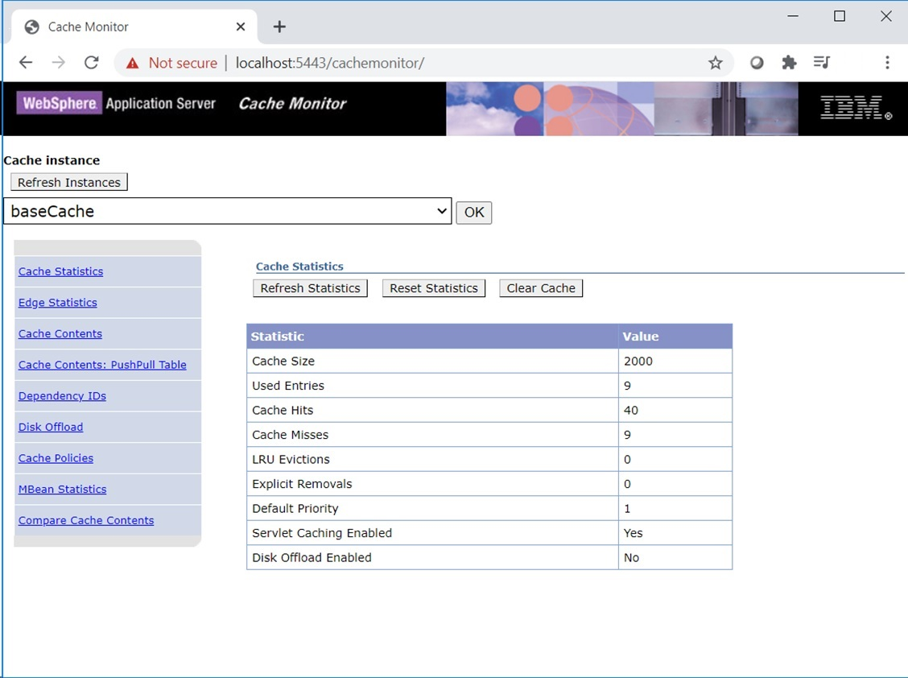

# WebSphere Cache Monitor

Although the WebSphere Cache monitor is supported, the HCL Cache provides newer functions and tools that are more suitable for managing a distributed cache system in production.

Consider the following use cases:
1. *Cache Monitoring*: The HCL Cache integrates with [Prometheus and Grafana](Monitoring.md) for real-time monitoring and alerting. 
2. *Cache Invalidations*: The [Cache Manager](CacheManager.md) provides REST APIs for clears and invalidations.
3. *Troubleshooting*: The [Cache Manager](CacheManager.md) has troubleshooting APIs, such as listing the cache ids for a dependency id, or details for a cache id. The
[Redis database](HCLCacheInRedis.md) can also be queried to inspect the cache or monitoring invalidations. See [Troubleshooting](Troubleshooting.md) for details.

The WebSphere Cache Monitor can be used in development to inspect the contents of Servlet and JSP fragment caching, and to assist with the development of [cachespec.xml](https://www.ibm.com/docs/en/was/9.0.5?topic=caching-cachespecxml-file) rules.

The WebSphere Cache Monitor only displays the contents and statistics of local caches. Cache clears and invalidations issued from the monitor are also executed on the remote cache and propagated to other containers (as applicable).

For installation steps see: [HCL Commerce 9.1 Help - Enabling cache monitoring](https://help.hcltechsw.com/commerce/9.1.0/admin/tasks/tdcenablecache.html).
