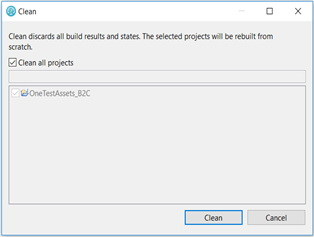

# OneTest Performance - Sample Script for Emerald Store

A key aspect of performance testing is the ability to simulate concurrent user load. The - OneTest Performance sample script for Emerald store - provides you with a sample project to generate and simulate user traffic against the Emerald store.
The script includes common search, browse, and checkout scenarios. The functionalities are not all inclusive and needs to be adapted to match your store customization and usage patterns.
The following steps will guide on how to import the script, set it up and start using it 

## Setting up the script  
The package comes in a zip file that contains the OneTest Performance script file  

The script was written with HCL Onetest Performance Version 10.2  
  

You would need 3 steps to setup the OneTest performance script. 
- A. Import the script  
- B. Import the libraries  
- C. Clean the project  

The details on these steps one by one will be found below:  

**A. Import the package**
1. Download the package file (zip file) to your machine and save it under a new folder 
2. Open OneTest and choose a new workspace, choose a location and an appropriate workspace name  
     
3. Close the Welcome tab  
4. Right click in the Test Navigator and select Import  
     
5. Select Test > Test Asset with Dependencies and click Next. Select the file you downloaded in step 1 and then click Finish.  
   

**B. Import the libraries**  
1. Expand the project as shown in the following screenshot:  
  
If a red x is displayed on src folder as shown above, then you need to complete the following steps (this situation can occur if you’re using OneTest version lesser than 10.1.x)  
2. Right click on the project name and select Properties in the context menu  
  
3. In the Properties window, select Java Build Path in the left pane and Libraries tab in the left pane  

4. Click the Add JARs button. In the JAR Selection window, expand the project and expand the libs folder. Select the jar files and click OK.  

5. Click on Apply and Close  

**C. Clean the project**  
1. Click on menu Project and choose Clean command  
2. On the Clean window, ensure the project is select and click on Clean button  

## Updating the script before using it  
Once the script has been imported and setup, you would need to make updates and apply initializations before you can start using it. For this, you would also need 3 steps as before:  
- A. Update global variables.  
- B. Update Datapools.  
- C. Update Schedules.  

The details for each step are below:  

**A – Update global variables**  
All the global variables reside in B2C_Homepage module.  
Select Resource View (highlighted icon in the screenshot), expand Modules_B2C, open B2C_Homepage module and expand Test Resources and Test Variables to see all the global variables.  
Change the value of the variables corresponding to your environment.  

The variables that need to be updated before using the performance script are:

| Variable | Description |
| --- | --- | 
| hostname | The hostname used in the URL of the e-commerce storefront | 
| store_id | The store id. The default store ids are 11 for Emerald B2C store and 12 for B2B Sapphire store. The store Administrator can provide store ids | 
| lang_id	| The default language id of the store. -1 is English | 
| catalog_id | The catalogue id used in the store. The store Administrator can provide catalogue ids | 
| port_num | The port number used in the URL of the storefront | 
| store_name | The store name. The complete URL of the storefront is hostname:port_num/store_name | 
| max_items_in_cart | Maximum number of items in the cart. For each user, the number of items to be added to the cart if calculated randomly to be between 1 and max_items_in_cart’s value
| fixed_number_of_items_in_cart | This variable shows if the number of items in the cart is fixed throughout the run or is randomly calculated to each user. The value of this variable can be 1 or 0 (1 means true and 0 means false)  - If fixed_number_of_items_in_cart = 1, then the number of items in the cart will be equal to the value of max_items_in_cart for all users.  - If fixed_number_of_items_in_cart = 0, then the number of items in the cart will be selected randomly for each user between 1 and the value of max_items_in_cart | 
| users_password | The password used for registered users. The script is configured to use a single password for all registered users. If you plan to use a different password for each user, you may need to create a different Datapool with 2 columns, one for the userId and one for its password | 
| email_domain | The email domain that will be added automatically to userids. It is set by default to ‘company.com’, so the emails will be with this format string_email@company.com where string_email is randomly generated string | 
| enable_80_20 | This variable enables (when equal to 1) or disables (when equal to 0) the 80/20 rule. When 80/20 rule is enabled by setting this variable to 1, it’ll change the way to pick randomly the categories and the products. 20% of categories and 20% of products will be picked 80% of the time. This will increase cache hit. When the 80/20 rule is disabled by setting this variable to 0, all the items in the storefront are picked randomly without any rule | 

No need to set or update the other variables. They’re just global variables.  

**B – Update Datapools**  
   1. In the Test Navigator, open Datapools folder.
   2. Open searchterm_oob datapool (Right click it > Open with > Text Editor) and change the content to put search terms related to your catalogue.
   3. Open userids datapool and update it with the userids that you previously prepared and loaded to the database. Users with the format “hcluser%” are pre-added in the datapool.  The registered users need to be loaded to your database ahead of starting the performance test. The users' passwords need also to be set for these new registered users as set by the variable users_password shown above.     
This page gives an example on how to load registered users:  
[Sample: Loading registered users](https://help.hcltechsw.com/commerce/9.1.0/data/refs/rmlsamplepeople.html)  
And this page gives a general overview or the dataload utility:  
[Overview of the Data Load utility](https://help.hcltechsw.com/commerce/9.1.0/data/concepts/cmlbatchoverview.html)

**C – Update Schedules**
  1. There are 4 schedules in this project:
  
| Schedule | Description | 
| --- | --- |
| B2CFlow | This is the most important schedule for driving production storefront load. It contains the shopping flow for registered users, shopping flow for guest users and search |
| TestB2CFlow | This schedule is the same as B2CFlow. It should be used for testing and debugging new modules or custom codes. It uses less users and the trace log is set to All. You may disable/enable portions of the schedules to test a part of the flow |
| B2CCleanCarts | Used to clean carts. It shows how we can build quickly new schedules by updating some modules (B2CGoToCart) and combining some modules together |
| B2CDeleteFromCart | This is used to add some items to cart and then clean the cart. This schedule shows how we can combine and add modules (without any change) to build a new schedule |
| B2CMyAccount | Used to test My Account for registered users. It adds and deletes addresses. This part is not included in B2CFlow because it may create a lot of shipping and billing addresses for each registered user which is not common |
  2. It is important that you check and update the following as required before running a performance test:  
  
**a. Show Advanced**  
When you open the schedule the first time, check Show Advanced checkbox to show up the “Change Rate” and “Settle Time” columns  
  

**b. User stage characteristics**  
To change user stage, select the row in the screenshot above and click on Edit. In the popup, you can change the number of users, duration of the run, the rate of starting the users and the settle time.  

The above setting runs the schedule using 20 users for 1h. The 20 users will be all started over 5 min.
The preview will change based on the above updates as follow:

  

**c. Think time**  
To check think time, click the drop down category and select Think Time. 
The think time is the time that OneTest insert between one request and the next one. It is small for stress load and between 2 to 5s for reliability load.  

**d. Statistics sampling**  
Check the statistics sampling by setting the log level and the interval time used by OneTest to gather statistics.  

Increase the interval for long runs and decrease it for small runs.  

**e. Test log** 
If you’re debugging an issue, you can set a small number of users and log levels to All. For long production runs and especially for high number of users, you should un-check Show errors and failures, warning and other types  
  

**f. Transactions Weight**  
Open the schedule and select Random Selector. In the right pane, you can change the weight based on the scenario you want to run. Changing the weight will change the percentage of the block on the schedule.  

## Run the schedule  

Once the previous steps are applied, open TestB2CFlow schedule and run it with 1 user for few minutes with full logs to check out for any issues   
  

